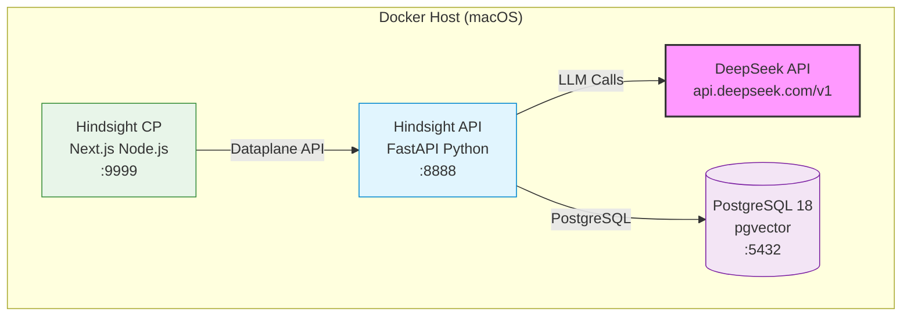

# Hindsight 本地 Docker 部署分析报告

| 字段 | 值 |
|------|-----|
| 版本 | v0.8.4 |
| 上游 | https://github.com/vectorize-io/hindsight |
| 分析日期 | 2026-07-07 |
| 当前分支 | wkj-dev |

---

## 1. 项目简介

Hindsight 是 Vectorize.io 开源的 Agent 记忆系统，超越传统 RAG 和知识图谱。核心概念：

- **Retain** — 记忆存储（提取实体/关系/时间序列 → 稀疏+稠密向量索引）
- **Recall** — 记忆检索（语义/BM25/图谱/时间 四路并行 + RRF 融合 + Cross-Encoder 重排序）
- **Reflect** — 深度分析（基于已有记忆生成新的洞察/观察）

架构层面记忆组织为三类：World（世界知识）、Experiences（Agent 自身经历）、Mental Models（反思形成的理解模型）。

---

## 2. 总体架构

```
┌───────────────────────────────────────────────────────────┐
│  Standalone Container (ghcr.io/vectorize-io/hindsight)    │
│                                                           │
│  ┌─────────────────────┐  ┌───────────────────────────┐  │
│  │  hindsight-api       │  │  hindsight-control-plane  │  │
│  │  (Python FastAPI)    │  │  (Next.js Node.js)       │  │
│  │  :8888               │  │  :9999                   │  │
│  └─────────┬───────────┘  └─────────┬─────────────────┘  │
│            │                         │                    │
│  ┌─────────▼─────────────────────────▼─────────────────┐  │
│  │  pg0-embedded (Embedded PostgreSQL + pgvector)      │  │
│  │  ~/.pg0/                                            │  │
│  └─────────────────────────────────────────────────────┘  │
└───────────────────────────────────────────────────────────┘
```

项目是 **uv monorepo**（Python + TypeScript/Node.js 混合）：

| 子包 | 说明 |
|------|------|
| `hindsight-api-slim` | Python FastAPI 后端（核心记忆引擎） |
| `hindsight-control-plane` | Next.js 管理面板（Node.js） |
| `hindsight-all-slim` | Python 嵌入式包（含所有依赖） |
| `hindsight-clients/typescript` | TypeScript SDK |
| `hindsight-clients/python` | Python SDK |

---

## 3. 部署方式对比

上游提供 4 种部署模式，对比如下：

### 3.1 模式一：Standalone 单容器（推荐快速启动）

| 特性 | 说明 |
|------|------|
| 镜像 | `ghcr.io/vectorize-io/hindsight:latest` |
| 数据库 | 内嵌 pg0（PostgreSQL + pgvector），无需外部 DB |
| 端口 | `8888` API / `9999` 控制面板 |
| 命令 | `docker run -e HINDSIGHT_API_LLM_API_KEY=$KEY ... ghcr.io/vectorize-io/hindsight:latest` |
| 存储 | `-v hindsight-data:/home/hindsight/.pg0` |
| 体积 | 镜像较大（含 ML 模型 + Next.js standalone） |

**优点**：启动最快，零外部依赖，适合快速验证。
**缺点**：pg0 是实验性嵌入式 PG，持久化需要 Docker named volume；不适合生产。

### 3.2 模式二：Docker Compose + 外部 PostgreSQL（推荐开发/生产）

| 特性 | 说明 |
|------|------|
| 服务 | `hindsight` + `db`（pgvector/pgvector 镜像） |
| 文件 | `docker/docker-compose/external-pg/docker-compose.yaml` |
| 数据库 | 独立 PostgreSQL 18 + pgvector 扩展 |
| 端口 | `8888` API / `9999` 控制面板 |
| 持久化 | PostgreSQL 数据用 named volume `pg_data` |

**优点**：数据库独立、稳定、可运维；pgvector 官方镜像成熟。
**缺点**：需要先配环境变量。

### 3.3 模式三：Standalone + 外部 LLM 侧车

| 特性 | 说明 |
|------|------|
| 配置 | `docker/docker-compose/local-llm/docker-compose.yaml` |
| LLM | llama.cpp server 容器，下载 GGUF 模型 |
| 适用 | 完全离线部署，不依赖外部 API |

**注意**：macOS Apple Silicon 下 Docker 内无法直通 GPU，llama.cpp 跑 CPU 只有 2-3 tok/s，不适合实际使用。

### 3.4 模式四：Nginx 反向代理

| 特性 | 说明 |
|------|------|
| 文件 | `docker/docker-compose/nginx/docker-compose.yml` |
| 用途 | 生产环境路径路由 `/hindsight` 前缀 |
| 端口 | `8080` Nginx / `9999` 控制面板直连 |

适合正式部署，开发环境不需要。

---

## 4. 推荐方案：Docker Compose + 外部 PostgreSQL

### 4.1 选择理由

| 维度 | 考量 |
|------|------|
| macOS ARM64 | pgvector 官方镜像有 arm64 支持 |
| MiniMax M2.7 | 性价比高，1M 上下文窗口，已配置 Key |
| 数据持久化 | pgvector 容器比嵌入式 pg0 更稳定 |
| Embeddings | 宿主机 Ollama bge-m3（中文最优） |
| 开发友好 | 可独立调试后端 |
| 与现有运维一致 | 循 DeerFlow 的 `my-docker/` 模式 |

### 4.2 所需配置

**关键环境变量**

| 变量 | 值 | 说明 |
|------|----|------|
| `HINDSIGHT_API_LLM_PROVIDER` | `openai`（非 `minimax`） | 绕过硬编码的 `api.minimax.io` 错误 |
| `HINDSIGHT_API_LLM_BASE_URL` | `https://api.minimaxi.com/v1` | MiniMax 正确端点 |
| `HINDSIGHT_API_LLM_API_KEY` | MiniMax Key | `sk-cp-...` 格式 |
| `HINDSIGHT_API_LLM_MODEL` | `MiniMax-M2.7` | M2.7 模型 |
| `HINDSIGHT_API_EMBEDDINGS_PROVIDER` | `openai` | 对接 Ollama |
| `HINDSIGHT_API_EMBEDDINGS_OPENAI_BASE_URL` | `http://host.docker.internal:11434/v1` | 宿主机 Ollama |
| `HINDSIGHT_API_EMBEDDINGS_OPENAI_MODEL` | `bge-m3` | 中文最优 |
| `HINDSIGHT_DB_PASSWORD` | 自定 | PostgreSQL 密码 |
| `HINDSIGHT_API_DATABASE_URL` | 自动生成 | 由 compose 模板填充 |

**端口占用**

| 端口 | 服务 | 冲突风险 |
|------|------|----------|
| 8888 | Hindsight API | 低（当前无占用） |
| 9999 | Hindsight Control Plane | 低 |
| 5432 | PostgreSQL（容器内） | 不暴露宿主机 |

### 4.3 与现有 my-docker/ 模式的适配

参考 DeerFlow 的 `my-docker/` 模式（本 fork wkj-dev 分支已有该惯例）：

```
my-docker/
├── docker-compose.yaml       # 独立 compose 文件
├── .env                      # 环境变量（不含密码/Key）
├── KEYS.md                   # API Key 记录（.gitignore 排除）
└── start.sh                  # 一键启动脚本
```

LLM 配置：复用宿主机的 DeepSeek API（不额外部署本地 LLM），`HINDSIGHT_API_LLM_PROVIDER=deepseek` 直连 DeepSeek 官方 API。

---

## 5. 架构图



### 数据流

```
Retain:  Client → HAPI(:8888) → DeepSeek(提取实体/关系) → PostgreSQL
Recall:  Client → HAPI(:8888) → 4路并行检索 → RRF合并 → Cross-Encoder → 结果
Reflect: Client → HAPI(:8888) → DeepSeek(深度分析) → 新记忆 → PostgreSQL
```

---

## 6. 关键依赖关系

```
hindsight-api-slim 核心依赖链:
├── fastapi + uvicorn          → Web 服务
├── asyncpg + psycopg2-binary  → PostgreSQL 驱动
├── sqlalchemy + alembic       → ORM + 数据库迁移
├── openai + anthropic         → LLM 提供商 SDK
├── litellm                    → 统一 LLM 接口
├── pgvector                   → 向量扩展
├── tiktoken                   → Token 计数
├── sentence-transformers[1]   → 本地 Embedding 模型
├── cross-encoder[1]           → 本地重排序模型
└── pg0-embedded[2]            → 嵌入式 PostgreSQL

[1] 仅 INCLUDE_LOCAL_MODELS=true 时包含
[2] 仅嵌入式模式使用
```

---

## 7. 注意事项与陷阱

1. **macOS Apple Silicon**：pgvector 官方镜像 `pgvector/pgvector:pg18` 有 arm64 支持，可直接使用
2. **Embeddings 配置**：默认使用本地 `BAAI/bge-small-en-v1.5`（sentence-transformers），首次启动会下载模型镜像（~400MB）。也可改用远程 `openai` embeddings 减少镜像体积
3. **pg0 数据权限**（如用 standalone 单容器）：容器运行在 UID 1000（hindsight 用户），主机 bind mount 时需注意 `chown`
4. **本地 LLM 在 Docker 内不可用 GPU**：macOS Docker Desktop 无法透传 GPU 给 Linux 容器，离线场景需在宿主机跑 llama-server
5. **外部 PostgreSQL 是稳定路径**：嵌入式 pg0 有已知数据完整性风险（issue #675），生产/开发请用独立 PostgreSQL
6. **镜像体积较大**：发布镜像含 Python ML 依赖（torch ~2GB），首次拉取需要时间。国内网络可配置 Docker mirror
7. **DeepSeek 不支持 Embeddings**：DeepSeek 只做 LLM 调用；Embeddings 必须用 `local`（默认）、`openai` 或其他独立提供商

---

## 8. 总结

| 维度 | 结论 |
|------|------|
| 推荐部署方式 | Docker Compose + 外部 PostgreSQL（`external-pg` 模式） |
| LLM 提供商 | DeepSeek v4-flash（复用现有 Key） |
| Embeddings | 默认 local（`BAAI/bge-small-en-v1.5`） |
| 存储目录 | `my-docker-vol/` 管理持久数据 |
| 配置文件 | `my-docker/` 自包含 |
| macOS ARM64 | 完全支持，pgvector 已有 arm64 镜像 |
