# Hindsight 架构演进分析 — 为什么从"分层"走向"bank + fact_type 双维度"

> 生成日期：2026-08-03
> 方法：源码迁移史实证（alembic 迁移链 + git log），非文档推断
> 上游版本：b5d8439c（官方最新）
> 背景：本系列文档此前以"L1/L2/L3 分层"理解 Hindsight，经源码验证确认系统无分层，真实维度为 bank + fact_type。本文深挖演进史，回答"为什么"。

---

## 一、演进时间线（迁移史实证）

### 阶段 0：初始 — memory_units 单表起步

初始 schema（`5a366d414dce_initial_schema.py`）就建立了 `memory_units` 单表 + `fact_type` 字段，类型含 world / experience / opinion / observation。**Hindsight 从第一天起就是单表模型，分层是后来的插曲。**

### 阶段 1：分层尝试 — mental_models 独立表时代

mental_models 被当作"特殊实体"，拥有独立表结构、版本表、历史表、max_tokens、结构化内容，先后经历 15+ 个迁移：

| 迁移 | 内容 |
|------|------|
| `h3c4d5e6f7g8` | mental_models_v4（独立表） |
| `j5e6f7g8h9i0` | mental_model_versions（版本表） |
| `c3d4e5f6g7h8` | 加 history（历史表） |
| `v7q8r9s0t1u2` | 加 max_tokens |
| `b3w4x5y6z7a8` | 加 structured_content |
| `u6p7q8r9s0t1` / `m8h9i0j1k2l3` | id 改 TEXT 类型 |
| `w8r9s0t1u2v3` | 修 PK 隔离 |

特征：**每次字段演进 = 一个独立迁移**。分层方案下，"心智模型"和"事实"被当作两套完全不同的数据结构维护。

### 阶段 2：第一次类型收敛 — opinion 被合并（2026-01-15）

`i4d5e6f7g8h9_delete_opinions.py` 原文：
> "Opinions are no longer a separate fact type - they are now represented through mental model observations with confidence scores."

**opinion 概念上无法与 world 划清边界**（"用户偏好"算 opinion 还是 world？），判别成本高，被合并进 observation。这是"类型必须互斥可判"原则的第一次实践。

### 阶段 3：分层峰值与急转 — 同一天内试错收敛（2026-01-21）

**同一天三个迁移**，完整呈现"尝试 → 验证 → 否定 → 合并"闭环：

```
n9i0j1k2l3m4  创建 learnings 表（自动归纳）+ pinned_reflections（用户精选）
o0j1k2l3m4n5  迁移 mental_models 数据进 learnings/pinned_reflections
p1k2l3m4n5o6  DROP learnings、DROP mental_models，合并进 memory_units！
```

`p1k2l3m4n5o6_new_knowledge_architecture.py` 设计注释（原文）：
> "The new architecture:
> - Directives: Hard rules in their own table
> - **Mental Models: Stored in memory_units with fact_type='mental_model'**
> - Reflections: User-curated documents (renamed from pinned_reflections)"

合并方式极简：`memory_units` 加三列 `proof_count`（支持该认知的事实数）、`source_memory_ids`（归纳来源数组）、`history`（JSONB 变更历史），加一个部分索引 `idx_memory_units_mental_models (bank_id, fact_type) WHERE fact_type='mental_model'`。**learnings 表存活不到一天。**

### 阶段 4：术语重命名 — 概念澄清（2026-01-26）

`t5o6p7q8r9s0_rename_mental_models_to_observations.py`：
> "Observations: Consolidated knowledge synthesized from facts (was mental_model)
> Mental Models: Stored reflect responses (was reflections)"

术语反转：**observation** = 从事实归纳的观测（事实的升华），**mental model** 改指 reflect 推理产物。概念边界最终清晰。

### 阶段 5：平级架构成熟（2026-02 至今）

- observation 持续演进，全部基于单表：search_vector 回填、orphan 清扫×2、tags 并入 memory_units、observation_sources 表
- 2026-04-02 彻底清理 opinion 残留（drop confidence_score 列）→ **类型最终收敛为 world / experience / observation 三个**
- 新能力建立在平级之上：`reversible curation`（edit/invalidate/revert）、`knowledge pages`（client-managed）、`pluggable memories storage backend`

---

## 二、为什么从分层到平级（深度分析）

### 1. 统一生命周期与 curation（操作一致性）

`de22b606 feat(memory): reversible curation` — 编辑/作废/恢复对任何记忆类型走同一条链路。

分层时代：事实和心智模型的生命周期不同步——编辑一个 fact 与编辑一个 mental model 是两套 CRUD 逻辑，invalidate 一个 mental model 还要处理它依赖的 facts。**每多一层，操作面就多一倍。**

平级后：一条 curation 链路处理所有类型，`edit/invalidate/revert` 天然一致。

### 2. 统一检索与统一排序（语义连续性）

当前实现（`retrieval.py:182`）：
> "Uses UNION ALL of per-fact_type subqueries so that each arm has its own ORDER BY ... LIMIT, enabling the partial HNSW indexes per fact_type"

即：**存储合一、索引分区、查询合一**——
- 存储：单表
- 索引：按 fact_type 的部分 HNSW 索引（`idx_mu_emb_world` / `idx_mu_emb_experience` / `idx_mu_emb_observation`），类型特定优化不丢失
- 查询：UNION ALL 合并各类型结果 + 统一 reranker 排序

结果是 recall 天然返回"事实 + 认知"混合列表，按相关性统一排序。分层时代 fact 检索和 mental model 检索分开，需要额外的融合逻辑（RRF 等），语义连续性被打断——**用户问一个问题，系统要分两次想**。

### 3. 索引体系单一化（运维成本）

分层时每层独立表 = 每层独立 embedding 列、独立 search_vector、独立 BM25 索引、独立向量索引。一次字段演进 = 一个迁移（mental_models 的 15+ 迁移就是证据）。

平级后：加列一次 ALTER 解决（如 observation tags 直接 `z1u2v3w4x5y6_add_observation_tags_to_memory_units`）。**单表的迁移成本是 O(1)，分层是 O(层数)。**

### 4. 概念连续性（认知本质）

world / experience / observation 是**同一连续谱**：事实（低抽象）→ 观测（高抽象），本质都是"记忆单元"。结构高度同构——都是 text + 时间 + 实体 + 标签，差异只是 `proof_count` / `source_memory_ids` 这类**溯源字段**。

分层强制割裂：把"心智模型"当成另一类东西，独立 schema、独立 CRUD、独立查询。但 LLM 归纳产物与原始事实在存储结构上几乎一样——**为 3 个溯源字段建一个表，是过度设计**。

### 5. 类型收敛的自我修正（opinion 教训）

| 事件 | 决策 | 原则 |
|------|------|------|
| opinion 删除（2026-01-15） | 并入 observation | 与 world 边界不清，判别成本高 |
| mental_model 并入单表（2026-01-21） | fact_type='mental_model' | 结构同构，不需独立表 |
| mental_model → observation 改名（2026-01-26） | 术语澄清 | 概念边界必须可教 |
| opinion 残留清理（2026-04-02） | drop 专用列 | 不留死类型 |

收敛原则：**类型必须"互斥可判"，否则就合并**。最终 3 类型——world（客观）/ experience（行为）/ observation（归纳）——判别清晰，无重叠。

### 6. 可插拔后端（未来演进）

`b769045b feat(engine): pluggable memories storage backend (#2917)` — 存储后端可替换。

分层架构下，每个后端都要实现 N 层结构（facts 表 + mental models 表 + learnings 表 + reflections 表），换后端成本爆炸。平级架构下，后端只需实现"一个 memory_units 语义"——**单表是后端可插拔的前提**。

### 7. bank 隔离的正交性

隔离维度（bank）与类型维度（fact_type）**正交**：bank × type 任意组合都成立（bank A 的 world、bank A 的 observation、bank B 的 world...）。

分层时代隔离与类型耦合：每层表都挂 bank_id 且独立管理——mental model 的隔离和 fact 的隔离是两套体系，删除一个 bank 要级联 N 层。平级后 `bank_id` 是唯一外键维度，**隔离逻辑单一，级联删除一次完成**。

### 8. 遗留的例外：directives 为什么保留独立表？

唯一存活的分层是 `directives`（硬规则表）。为什么它没被合并？

判据：**是否参与"检索-归纳-遗忘"的记忆生命周期**——
- directives 是**规则**不是**记忆**：不可被 consolidation 修改、不参与语义检索（无 embedding 语义）、优先级/激活状态是管理属性
- memory_units 是**记忆**：参与 retain（写入）→ consolidation（归纳）→ recall（检索）→ invalidate（遗忘）完整生命周期

**分层与否的分界线不是"抽象层级"，而是"生命周期是否一致"。** 生命周期一致 → 单表 + 类型字段；生命周期独立 → 独立表。这是整个演进给我们的最终设计准则。

---

## 三、对使用者的启示

1. **用 bank 隔离域，用 fact_type 区分类型**——系统只有这两个维度，不要自己发明"分层"
2. **类型设计遵循"互斥可判"**——opinion 的教训：边界不清的类型不如合并
3. **判断是否独立存储看生命周期**——参与"检索-归纳-遗忘"的进 memory_units；规则/配置类（如 directives）才独立表
4. **单表平级 + 部分索引是通用模式**——存储合一、索引分区、查询合一，兼顾统一性与类型感知优化

---

## 四、关键源码位置速查

| 关注点 | 位置 |
|--------|------|
| 分层→平级转折迁移（DROP learnings/mental_models） | `alembic/versions/p1k2l3m4n5o6_new_knowledge_architecture.py` |
| 术语重命名（mental_model→observation） | `alembic/versions/t5o6p7q8r9s0_rename_mental_models_to_observations.py` |
| opinion 合并（第一次类型收敛） | `alembic/versions/i4d5e6f7g8h9_delete_opinions.py` |
| opinion 残留清理（最终收敛 3 类型） | `alembic/versions/g2h3i4j5k6l7_remove_opinion_fact_type.py` |
| 当前 fact_type 枚举（权威） | `engine/response_models.py:13` — world/experience/observation |
| 单表统一检索（UNION ALL per-fact_type） | `engine/search/retrieval.py:182-196` |
| consolidation 写 observation（同表） | `engine/consolidation/consolidator.py:978,2290` |
| MemoryUnit 模型（无 level/layer 字段） | `engine/memories/base.py:123-143` |
| 可插拔存储后端 | commit `b769045b`（#2917） |
| knowledge pages（平级上的新能力） | `alembic/versions/a9b8c7d6e5f4_add_knowledge_pages.py` |

---

## 五、当前版本（v0.8.4）全部实体表结构

> 数据来源：运行中数据库 `hindsight-db`（迁移链最终态，`information_schema.columns` 实查），共 **20 张实体表**（另含 `alembic_version` 元数据表）。
> 类型说明：`vector` = pgvector 嵌入列（psql 显示 USER-DEFINED）；`varchar[]` = 数组；`tsvector` = 全文搜索向量。

### 核心记忆表

#### 1. `banks` — 记忆库（唯一隔离维度）

| 列 | 类型 | 可空 | 默认值 |
|----|------|------|--------|
| bank_id | text | NO | —（主键） |
| name | text | YES | — |
| disposition | jsonb | NO | `{"empathy":3,"literalism":3,"skepticism":3}`（性格 1-5，影响 reflect） |
| mission | text | YES | —（身份使命） |
| config | jsonb | NO | `{}`（per-bank 配置） |
| internal_id | uuid | NO | gen_random_uuid() |
| created_at / updated_at | timestamptz | NO | now() |
| last_consolidated_at | timestamptz | YES | — |
| mission_changed_at | timestamptz | YES | — |

#### 2. `documents` — 原始输入

| 列 | 类型 | 可空 | 默认值 |
|----|------|------|--------|
| id | text | NO | —（主键） |
| bank_id | text | NO | — |
| original_text | text | YES | — |
| content_hash | text | YES | — |
| retain_params | jsonb | YES | — |
| tags | varchar[] | NO | `{}` |
| file_storage_key / file_original_name / file_content_type | text | YES | —（文件类文档） |
| created_at / updated_at | timestamptz | NO | now() |

#### 3. `chunks` — 文档分块

| 列 | 类型 | 可空 | 默认值 |
|----|------|------|--------|
| chunk_id | text | NO | —（主键） |
| document_id | text | NO | — |
| bank_id | text | NO | — |
| chunk_index | integer | NO | — |
| chunk_text | text | NO | — |
| content_hash | text | YES | — |
| created_at | timestamptz | NO | now() |

#### 4. `memory_units` — 核心记忆单元（单表平级，fact_type 区分类型）

| 列 | 类型 | 可空 | 默认值 | 说明 |
|----|------|------|--------|------|
| id | uuid | NO | gen_random_uuid() | 主键 |
| bank_id | text | NO | — | 隔离维度 |
| document_id | text | YES | — | 溯源 |
| text | text | NO | — | 记忆内容 |
| embedding | vector | YES | — | 语义向量 |
| context | text | YES | — | 上下文 |
| event_date / occurred_start / occurred_end / mentioned_at | timestamptz | YES | — | 时间维度 |
| **fact_type** | text | NO | `'world'` | **类型：world / experience / observation** |
| access_count | integer | NO | 0 | 访问计数 |
| metadata | jsonb | NO | `{}` | 元数据（含 harness 标记） |
| chunk_id | text | YES | — | 分块溯源 |
| tags | varchar[] | NO | `{}` | 标签 |
| proof_count | integer | YES | 1 | 支持该观测的事实数 |
| source_memory_ids | uuid[] | YES | `{}` | 归纳来源（observation 用） |
| consolidated_at | timestamptz | YES | — | 归纳时间 |
| observation_scopes | jsonb | YES | — | 观测作用域 |
| text_signals | text | YES | — | 文本信号 |
| search_vector | tsvector | YES | — | BM25 全文索引 |
| consolidation_failed_at | timestamptz | YES | — | 归纳失败标记 |
| edited_at | timestamptz | YES | — | 编辑时间（curation） |
| created_at / updated_at | timestamptz | NO | now() | |

#### 5. `invalidated_memory_units` — 作废记忆（reversible curation）

结构 = memory_units 超集（作废后保留原文供恢复/审计），额外列：

| 列 | 类型 | 可空 | 默认值 |
|----|------|------|--------|
| id / bank_id / document_id / text / context / event_date / occurred_start / occurred_end / mentioned_at / fact_type / access_count / metadata / chunk_id / tags / proof_count / source_memory_ids / consolidated_at / observation_scopes / text_signals / search_vector / consolidation_failed_at / edited_at | 同 memory_units | — | — |
| entity_ids | uuid[] | YES | — |
| invalidation_reason | text | YES | — |
| invalidated_at | timestamptz | YES | now() |
| created_at / updated_at | timestamptz | NO | now() |

### 知识图谱表

#### 6. `entities` — 实体

| 列 | 类型 | 可空 | 默认值 |
|----|------|------|--------|
| id | uuid | NO | gen_random_uuid() |
| canonical_name | text | NO | —（规范化名称） |
| bank_id | text | NO | — |
| metadata | jsonb | NO | `{}` |
| first_seen / last_seen | timestamptz | NO | now() |
| mention_count | integer | NO | 1 |

#### 7. `unit_entities` — 记忆单元-实体关联（junction）

| 列 | 类型 | 可空 | 默认值 |
|----|------|------|--------|
| unit_id | uuid | NO | —（FK → memory_units.id） |
| entity_id | uuid | NO | —（FK → entities.id） |

#### 8. `entity_cooccurrences` — 实体共现

| 列 | 类型 | 可空 | 默认值 |
|----|------|------|--------|
| entity_id_1 | uuid | NO | — |
| entity_id_2 | uuid | NO | — |
| cooccurrence_count | integer | NO | 1 |
| last_cooccurred | timestamptz | NO | now() |

#### 9. `memory_links` — 记忆间关联边

| 列 | 类型 | 可空 | 默认值 |
|----|------|------|--------|
| from_unit_id | uuid | NO | —（FK） |
| to_unit_id | uuid | NO | —（FK） |
| link_type | text | NO | —（如 caused_by） |
| entity_id | uuid | YES | — |
| weight | double precision | NO | 1.0 |
| bank_id | text | NO | — |
| created_at | timestamptz | NO | now() |

### 知识/规则表

#### 10. `directives` — 硬规则（唯一保留独立表的例外）

| 列 | 类型 | 可空 | 默认值 |
|----|------|------|--------|
| id | uuid | NO | gen_random_uuid() |
| bank_id | text | NO | — |
| name | varchar | NO | — |
| content | text | NO | — |
| priority | integer | NO | 0 |
| is_active | boolean | NO | true |
| tags | varchar[] | YES | `{}` |
| created_at / updated_at | timestamptz | NO | now() |

#### 11. `mental_models` — reflect 响应（注意：非旧分层表）

> 由原 `reflections`（pinned_reflections）改名而来，存储 **reflect 推理产物**，与 memory_units 中的 observation（fact_type）是不同概念。

| 列 | 类型 | 可空 | 默认值 |
|----|------|------|--------|
| id | text | NO | gen_random_uuid() |
| bank_id | text | NO | — |
| name | varchar | NO | — |
| source_query | text | NO | — |
| content | text | NO | — |
| embedding | vector | YES | — |
| tags | varchar[] | YES | `{}` |
| reflect_response | jsonb | YES | — |
| max_tokens | integer | NO | 2048 |
| trigger | jsonb | NO | `{"refresh_after_consolidation":false}` |
| structured_content | jsonb | YES | — |
| subtype | varchar | NO | `'structural'` |
| description | text | NO | `''` |
| entity_id | uuid | YES | — |
| observations | jsonb | YES | `{"observations":[]}` |
| links | ARRAY | YES | — |
| last_refreshed_at / last_refreshed_source_query / last_updated | — | YES | — |
| search_vector | tsvector | YES | — |
| created_at | timestamptz | NO | now() |

#### 12. `mental_model_history` — reflect 响应历史

| 列 | 类型 | 可空 | 默认值 |
|----|------|------|--------|
| id | bigint | NO | —（自增） |
| mental_model_id | varchar | NO | — |
| bank_id | text | NO | — |
| content | jsonb | NO | — |
| changed_at | timestamptz | NO | now() |

#### 13. `observation_history` — observation 变更历史

| 列 | 类型 | 可空 | 默认值 |
|----|------|------|--------|
| id | bigint | NO | —（自增） |
| observation_id | uuid | NO | —（FK → memory_units.id） |
| bank_id | text | NO | — |
| content | jsonb | NO | — |
| changed_at | timestamptz | NO | now() |

### 运维/追踪表

#### 14. `async_operations` — 异步操作队列

| 列 | 类型 | 可空 | 默认值 |
|----|------|------|--------|
| operation_id | uuid | NO | gen_random_uuid() |
| bank_id | text | NO | — |
| operation_type | text | NO | — |
| status | text | NO | `'pending'` |
| task_payload | jsonb | YES | — |
| worker_id / claimed_at | — | YES | — |
| retry_count | integer | NO | 0 |
| next_retry_at | timestamptz | YES | — |
| result_metadata | jsonb | NO | `{}` |
| error_message | text | YES | — |
| created_at / updated_at / completed_at | timestamptz | — | — |

#### 15. `llm_requests` — LLM 调用追踪（OTel）

| 列 | 类型 | 可空 | 默认值 |
|----|------|------|--------|
| id | uuid | NO | gen_random_uuid() |
| bank_id / operation / scope | text | YES | — |
| trace_id / span_id / parent_span_id | text | YES | — |
| provider / model | text | YES | — |
| status | text | NO | — |
| duration_ms | integer | YES | — |
| input_tokens / output_tokens / cached_tokens / total_tokens | integer | YES | — |
| input / output / error | jsonb | YES | — |
| llm_info / metadata | jsonb | YES | `{}` |
| started_at / ended_at | timestamptz | — | — |

#### 16. `audit_log` — 审计日志

| 列 | 类型 | 可空 | 默认值 |
|----|------|------|--------|
| id | uuid | NO | gen_random_uuid() |
| action | text | NO | — |
| transport | text | NO | — |
| bank_id | text | YES | — |
| request / response / metadata | jsonb | YES | — |
| started_at / ended_at | timestamptz | — | — |

#### 17. `webhooks` — Webhook 配置

| 列 | 类型 | 可空 | 默认值 |
|----|------|------|--------|
| id | uuid | NO | gen_random_uuid() |
| bank_id | text | YES | — |
| url | text | NO | — |
| secret | text | YES | — |
| event_types | text[] | NO | `{}` |
| enabled | boolean | NO | true |
| http_config | jsonb | NO | `{}` |
| created_at / updated_at | timestamptz | NO | now() |

#### 18. `file_storage` — 文件存储（大文件）

| 列 | 类型 | 可空 | 默认值 |
|----|------|------|--------|
| storage_key | text | NO | —（主键） |
| data | bytea | NO | — |

#### 19. `bank_stats_cache` — bank 统计缓存

| 列 | 类型 | 可空 | 默认值 |
|----|------|------|--------|
| bank_id | text | NO | — |
| payload | jsonb | NO | — |
| computed_at | timestamptz | NO | now() |

#### 20. `graph_maintenance_queue` — 图谱维护队列

| 列 | 类型 | 可空 | 默认值 |
|----|------|------|--------|
| bank_id | text | NO | — |
| unit_id | uuid | NO | — |
| enqueued_at | timestamptz | NO | now() |

---

## 六、表结构解读（与架构演进的关系）

1. **memory_units 是唯一记忆主表**：20 张表中，承载"记忆内容"的只有 memory_units（+ invalidated_memory_units 作废副本）。其余 18 张表是支撑件：溯源（documents/chunks）、图谱（entities/entity_cooccurrences/unit_entities/memory_links）、规则与推理（directives/mental_models）、追踪（async_operations/llm_requests/audit_log）、辅助（webhooks/file_storage/bank_stats_cache/graph_maintenance_queue）、历史（mental_model_history/observation_history）。
2. **observation 无独立表**：observation 的溯源字段（proof_count/source_memory_ids/observation_scopes）全部内嵌在 memory_units 列中——这就是"分层→平级"的落点。
3. **directives 是唯一例外**：硬规则不参与"检索-归纳-遗忘"生命周期，保留独立表（印证第四节判据）。
4. **mental_models 表名易误导**：它是 reflect 响应（推理产物，用户可刷新），不是旧分层架构的 mental_models 表——旧表已 DROP，此表由 reflections 改名而来。
5. **observation_sources 表不存在**：迁移链中曾创建（k6l7m8n9o0p1），最终架构未保留——observation 来源改由 memory_units 列承载，再次印证"能内嵌就不建表"的收敛原则。

---

## 七、实体关系（mermaid ER 图）

> 依据：数据库 `pg_constraint` 实查外键约束（2026-08-03）。复合外键（如 documents 的 bank_id+document_id）在逻辑图中简化为单边关系。

### 7.1 记忆核心 ER（10 张表，全部真实外键）

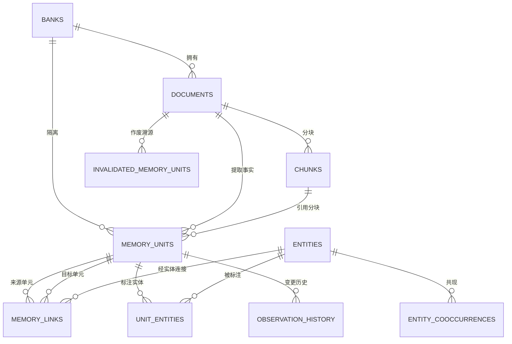

### 7.2 规则 / 推理 / 运维 ER（5 张表，真实外键）

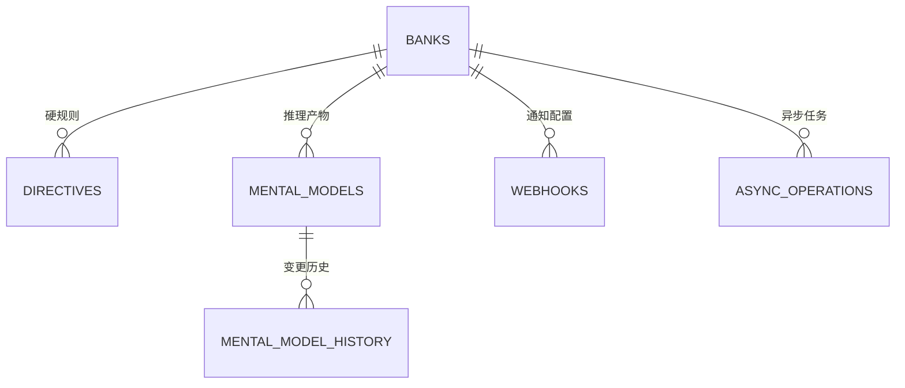

### 7.3 无外键约束的表（逻辑关联）

以下 5 张表在数据库中**无 FK 约束**，仅通过业务字段逻辑关联：

| 表 | 逻辑关联键 | 关联对象 |
|----|-----------|---------|
| `llm_requests` | bank_id | banks（LLM 调用追踪，per-bank 维度） |
| `audit_log` | bank_id | banks（审计日志） |
| `bank_stats_cache` | bank_id | banks（统计缓存） |
| `graph_maintenance_queue` | bank_id | banks（图谱维护队列） |
| `file_storage` | storage_key | documents.file_storage_key（大文件，documents 侧逻辑引用） |

### 7.4 复合外键说明（psql 实查）

| 表 | 复合键 | 说明 |
|----|--------|------|
| `chunks` | (bank_id, document_id) → documents | 分块按 bank+document 定位 |
| `memory_units` | (bank_id, document_id) → documents | 记忆按 bank+document 溯源 |
| `invalidated_memory_units` | (bank_id, document_id) → documents | 作废记忆溯源 |
| `mental_model_history` | (bank_id, mental_model_id) → mental_models | 历史按 bank+mm 定位 |

### 7.5 关系全景图（flowchart 视角，含逻辑关联）

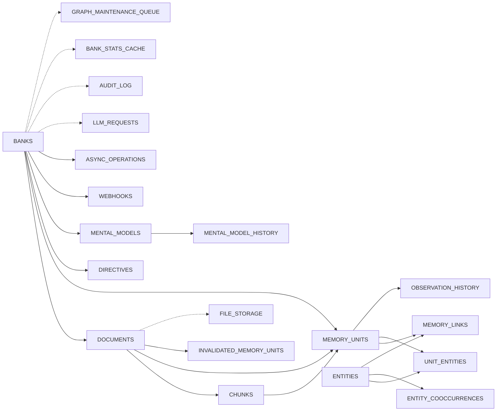

> 图例：`-->` = 真实外键；`-.->` = 逻辑关联（无 FK 约束）

---

## 八、对外 API 数据流转时序图（一个 API 一张图）

> 依据：运行中 API 的 OpenAPI schema（localhost:8888/openapi.json，v0.8.4，56 端点）+ 源码调用链。
> 参与者：`Client` 调用方 → `API` FastAPI 路由 → `Engine` MemoryEngine → `LLM` 事实提取/合成 → `Embedder` 向量嵌入（本地 bge-m3）→ `PG` PostgreSQL 实体表。
> 图中消息标注**字段级流转**：请求体字段 → 引擎处理 → 落表字段。

### 8.0 API 总览（56 端点分类）

| 分类 | 端点 | 数量 |
|------|------|------|
| 核心记忆操作 | memories（retain/recall）、reflect、consolidate | 4 |
| bank 管理 | banks CRUD、profile、config、background、stats | 10 |
| 文档管理 | documents CRUD、chunks、reprocess、transfer、files/retain | 10 |
| 记忆管理 | memories/list、curate、history、dry-run、observations | 8 |
| 知识图谱 | entities、entities/graph、graph | 3 |
| 规则与推理 | directives CRUD、mental-models CRUD+refresh | 11 |
| 运维 | operations、llm-requests、audit-logs、webhooks、health、metrics、version | 10 |

### 8.1 Retain — POST /v1/default/banks/{bank_id}/memories（存记忆，走 LLM）

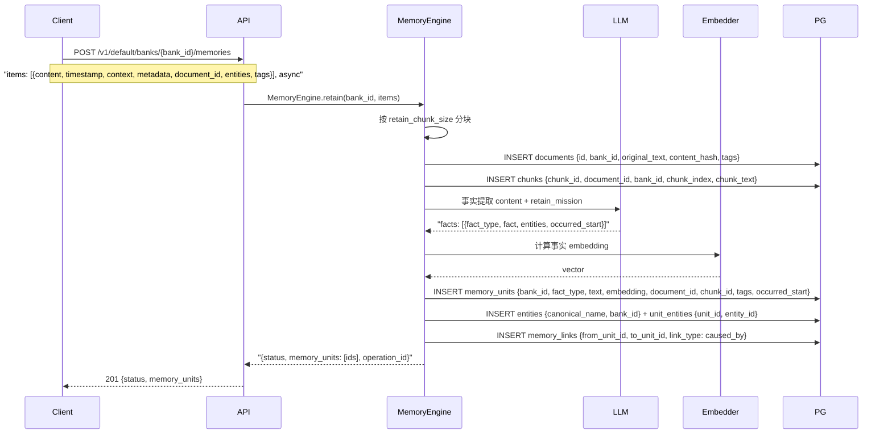

### 8.2 Recall — POST /v1/default/banks/{bank_id}/memories/recall（查记忆，4 路检索）

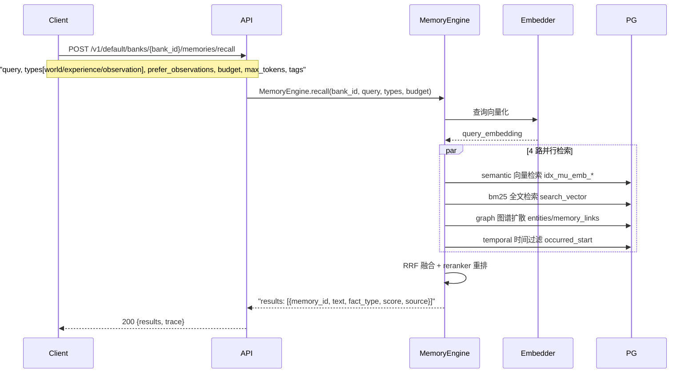

### 8.3 Reflect — POST /v1/default/banks/{bank_id}/reflect（推理合成，走 LLM）

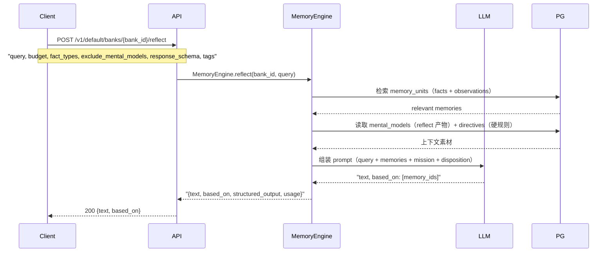

### 8.4 Consolidate — POST /v1/default/banks/{bank_id}/consolidate（后台归纳，写 observation）

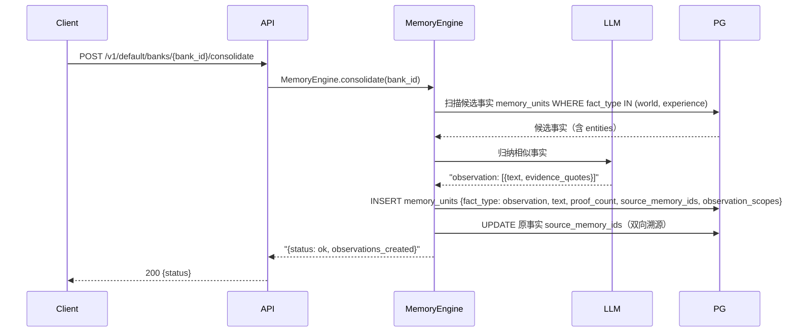

### 8.5 Create Bank — PUT /v1/default/banks/{bank_id}（建库）

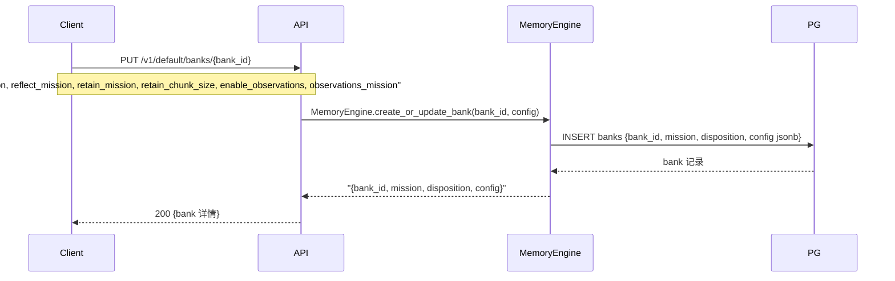

### 8.6 Curate Memory — PATCH /v1/default/banks/{bank_id}/memories/{memory_id}（编辑/作废）

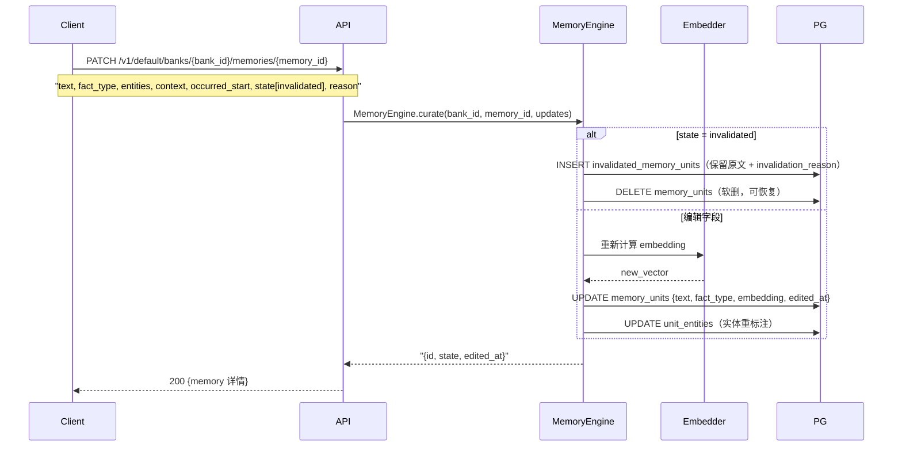

### 8.7 Delete Document — DELETE /v1/default/banks/{bank_id}/documents/{document_id}（级联删）

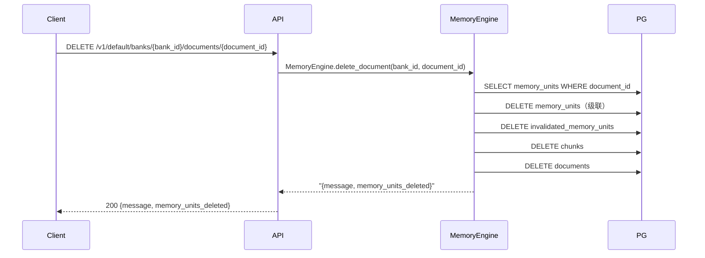

### 8.8 Create Directive — POST /v1/default/banks/{bank_id}/directives（硬规则）

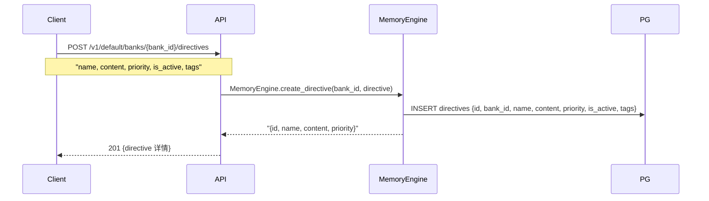

### 8.9 Refresh Mental Model — POST /v1/default/banks/{bank_id}/mental-models/{mental_model_id}/refresh（重跑 reflect 产物）

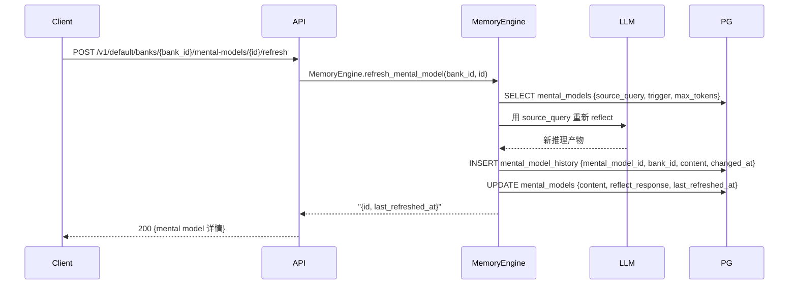

### 8.10 字段流转要点小结（中文说明 + 场景流程）

#### 1. Retain — 存记忆（写入核心）

**中文说明**：把一段对话、文档或文本内容存入记忆库。系统用 LLM 自动提取结构化事实（区分世界知识/个人经历）、解析实体、计算向量，写入核心表并建立关联。

**场景流程**：Agent 会话结束/文档入库时调用。典型流程：调用方提交内容 → 系统分块 → 原文存档（documents/chunks）→ LLM 提取事实 → 事实向量化 → 写入 memory_units → 实体/关联落库。`async=true` 时后台异步处理，返回 operation_id 可轮询进度。

| 请求关键字段 | 落表（写） | 读表 |
|------------|-----------|------|
| content / tags / entities / document_id | documents、chunks、memory_units、entities、unit_entities、memory_links | — |

#### 2. Recall — 查记忆（检索）

**中文说明**：根据查询词检索相关记忆。4 路并行召回（语义向量/全文/图谱/时间）后融合重排，返回最相关的事实列表——"把相关记忆摆到面前"。

**场景流程**：每次任务开始前注入上下文时调用。典型流程：提交 query → 查询向量化 → 4 路并行检索 → RRF 融合 → 重排 → 返回按相关度排序的结果。可用 types 限定事实类型、tags 限定标签范围。

| 请求关键字段 | 落表（写） | 读表 |
|------------|-----------|------|
| query / types / budget / tags | — | memory_units（4 路）、entities、memory_links |

#### 3. Reflect — 推理合成（读后思考）

**中文说明**：基于记忆库中的相关事实、观测和心智模型，让 LLM 综合推理后给出有依据的回答——"读完记忆后替你得出结论"，不是简单检索。

**场景流程**：需要跨多段记忆综合判断时调用。典型流程：提交 query → 检索相关记忆 + 读取 mental_models/directives → 组装 prompt（含 mission/disposition）→ LLM 合成 → 返回 text + based_on（引用了哪些记忆）。支持 response_schema 结构化输出。

| 请求关键字段 | 落表（写） | 读表 |
|------------|-----------|------|
| query / fact_types / response_schema | — | memory_units、mental_models、directives |

#### 4. Consolidate — 触发归纳（升华）

**中文说明**：手动触发后台归纳任务：扫描重复/相似事实，用 LLM 折叠成 observation（带证据引文和溯源），实现"从记录到认知"的升华。日常由系统自动调度，此端点用于手动干预。

**场景流程**：批量导入大量事实后想立即归纳时调用。典型流程：提交空请求 → 扫描候选事实 → LLM 归纳相似项 → 写 observation（同表 fact_type 区分）→ 双向溯源（source_memory_ids）。

| 请求关键字段 | 落表（写） | 读表 |
|------------|-----------|------|
| — | memory_units（observation） | memory_units（候选事实） |

#### 5. Create Bank — 建库（隔离空间）

**中文说明**：创建/更新一个记忆库（大脑）。每个 bank 独立隔离，可配置身份使命（mission）、归纳开关、分块大小等 per-bank 参数。

**场景流程**：新 agent 或新项目接入时调用。典型流程：提交 bank_id + 配置 → 写入 banks 表 → 返回 bank 详情。后续该 bank 的所有记忆操作都独立于其他 bank。

| 请求关键字段 | 落表（写） | 读表 |
|------------|-----------|------|
| mission / retain_mission / enable_observations | banks | — |

#### 6. Curate — 编辑/作废记忆（修正）

**中文说明**：修正错误记忆：可编辑事实内容（重算向量、重标实体）或软作废（移入 invalidated_memory_units，可恢复）——"新事实优先于旧事实"的落点。

**场景流程**：发现记忆错误或过时时调用。典型流程：提交 memory_id + 更新字段 → 若 state=invalidated 则移入作废表并记录原因；否则更新文本/类型/实体并重算向量。编辑历史写入 observation_history。

| 请求关键字段 | 落表（写） | 读表 |
|------------|-----------|------|
| text / fact_type / state / reason | memory_units 或 invalidated_memory_units | memory_units |

#### 7. Delete Document — 删除文档（级联清理）

**中文说明**：删除一份原始文档及其派生的全部数据（分块、提取的记忆、作废副本）——整条溯源链清理。

**场景流程**：文档失效/误导入时调用。典型流程：提交 document_id → 查出关联记忆 → 逐层删除（memory_units → invalidated → chunks → documents）→ 返回删除数量。

| 请求关键字段 | 落表（写） | 读表 |
|------------|-----------|------|
| — | 级联删 documents/chunks/memory_units | memory_units |

#### 8. Create Directive — 建硬规则（约束）

**中文说明**：创建一条硬规则：不参与检索归纳、不被自动修改，只在 reflect/推理时作为约束注入——唯一保留独立表的记忆类型。

**场景流程**：定义项目/agent 的强制规则时调用。典型流程：提交 name + content + priority → 写入 directives 表 → 后续 reflect 自动携带该规则。is_active=false 可停用。

| 请求关键字段 | 落表（写） | 读表 |
|------------|-----------|------|
| name / content / priority | directives | — |

#### 9. Refresh MM — 刷新推理产物（重跑 reflect）

**中文说明**：按 mental model 记录的 source_query 重新执行一次 reflect，更新推理产物并留历史——让"认知"跟上"记忆"的最新变化。

**场景流程**：记忆库大量更新后想刷新既有结论时调用。典型流程：提交 mental_model_id → 读取其 source_query → 重新 reflect → 写 history → 更新 content/last_refreshed_at。

| 请求关键字段 | 落表（写） | 读表 |
|------------|-----------|------|
| — | mental_models、mental_model_history | mental_models |
