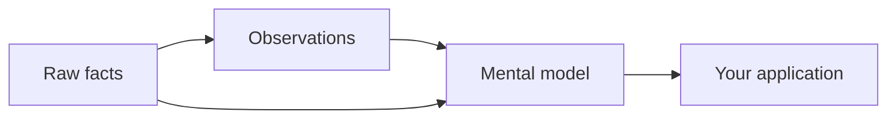

# Mental Models

A **mental model** is a standing answer to a question about a bank. You define the question once; Hindsight writes the answer, keeps it stored, and rewrites it in the background as the bank learns more.

Where [observations](./observations) are produced automatically and are atomic — one belief at a time — a mental model is deliberately curated: you decide which questions deserve a permanent, always-current answer.

---

## The Answer Is Already Written

The reason to use a mental model is speed. Reasoning over a bank's memory is expensive — retrieval, synthesis, an LLM writing an answer. A mental model moves all of that off the request path: the work happens in the background, ahead of time, and your application simply **reads the current version**.

Fetching a mental model is a database read. No retrieval, no synthesis, no LLM call, no waiting. An agent that boots by loading its mental models starts with a page of settled knowledge instead of spending its first few seconds rediscovering it.

This also makes answers **consistent**. Two users asking the same question get the same document, because there is only one document — not two independently generated answers that happen to disagree on the details.

Mental models are also the first thing [reflect](./reflect) reaches for. Its retrieval ladder goes:

| Layer | Produced by | Granularity |
|---|---|---|
| **Mental models** | You, explicitly | A whole document per question |
| **Observations** | Consolidation, automatically | One belief per fact cluster |
| **Raw facts** | Retain, automatically | One fact per statement |

Each layer is a cheaper, more settled version of the one below it. If the first step turns up a mental model that is fresh and covers the question, reflect can answer from it instead of descending through observations and raw facts — the same saving, applied inside the agentic loop.

---

## Always Current, Without Asking

A mental model is not a cached answer that goes stale silently. Hindsight tracks whether new memories have arrived that the model is supposed to cover, and rebuilds it when they have — either as soon as new knowledge is consolidated, or on a schedule you set.

The check comes first, and it is scoped: a rebuild only happens when something *within this model's own scope* actually changed. A busy bank does not cause unrelated models to churn, and a scheduled rebuild over an unchanged bank costs nothing.

When a model is handed to the reflect agent, it comes with a freshness signal — whether memories in its scope have landed since it was last written. A model that has fallen behind is still shown, but it no longer short-circuits retrieval, and the agent is expected to check it against the layers below rather than trust it blindly.

---

## Stable Across Rewrites

A document that is rewritten hundreds of times has a problem an LLM cannot solve by being asked nicely: told to "preserve the unchanged parts", it will still drift. Bullets become numbers, casing shifts, sentences get quietly paraphrased. Generating text is what the model does; copying it verbatim is not.

Hindsight can instead refresh a model **incrementally** — applying only the changes the new knowledge implies, and leaving everything else physically untouched rather than regenerating and hoping. A long-lived playbook stays the document you wrote, with the new parts added, instead of slowly becoming a different document that says roughly the same thing.

---

## Scope and Isolation

A mental model's tags decide two things: which memories it is allowed to read, and which callers are allowed to see it. A model scoped to one customer, team, or user is built only from that scope's memories and surfaces only for requests in that scope — the same isolation rules that govern the rest of the bank, applied to synthesized knowledge.

---

## Provenance

A mental model is not free-floating prose. It records the facts and observations it was built from, and it keeps the previous version of its content every time it changes. You can see what the model said last month and what evidence it was standing on — which matters when a model states something surprising and someone needs to know where it came from.

---

**See also:** [Mental Models API](./api/mental-models) — creating, refreshing, and configuring them, including refresh triggers, scoping options, and history.
